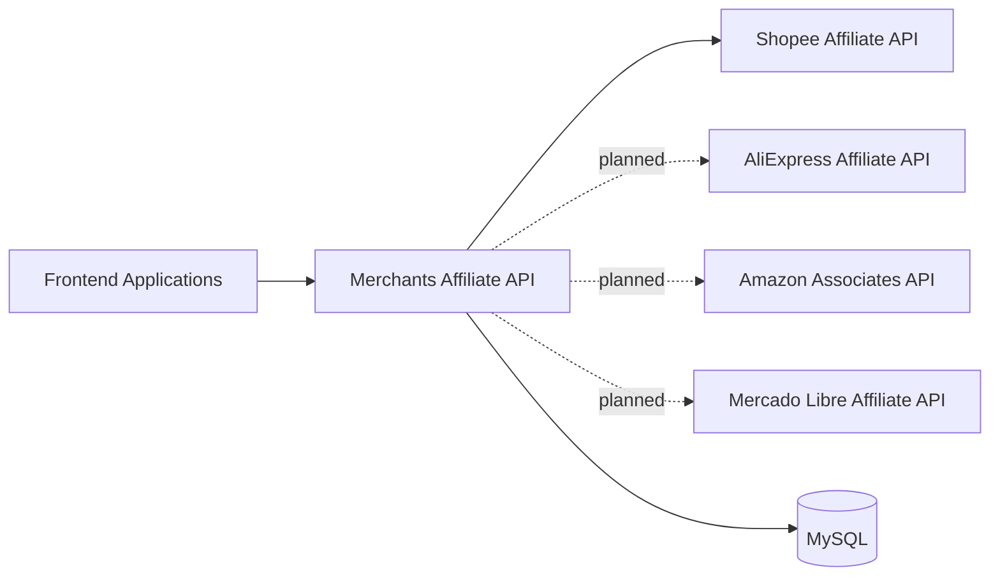

# Merchants Affiliate API


A REST API that provides a single integration layer for affiliate product services from multiple marketplaces.

Instead of requiring frontend applications to understand and connect to each merchant's API independently, this service centralizes authentication, request validation, affiliate-link generation, product discovery, offer retrieval, and response normalization behind one consistent interface.

## Why This Project Exists

Affiliate platforms expose different APIs, authentication methods, request formats, and response structures. That creates unnecessary coupling and duplicated integration logic across client applications.

Merchants Affiliate API acts as an intermediary between those platforms and the frontend applications that consume their data:



This architecture gives client applications:

- One stable REST interface for multiple affiliate providers.
- Less provider-specific logic and fewer credentials in frontend codebases.
- Centralized validation, security, rate limiting, and error handling.
- A foundation for normalized product and offer data across marketplaces.
- Easier adoption of new providers without redesigning every client.

## Integration Status

| Provider | Status | Current Scope |
| --- | --- | --- |
| Shopee | In progress | Affiliate links, product offers, and platform offers |
| AliExpress | Planned | Not yet implemented |
| Amazon | Planned | Not yet implemented |
| Mercado Libre | Planned | Not yet implemented |

> The current API surface is focused on Shopee. The other providers are part of the project roadmap and should not be considered available yet.

## Features

- REST endpoints built with NestJS and TypeScript.
- Shopee affiliate-link generation.
- Shopee product and campaign offer retrieval.
- DTO-based payload validation and transformation.
- API-key authentication for protected routes.
- Global request throttling.
- MySQL persistence for generated links and related configuration.
- Environment validation with Zod.
- Unit and end-to-end test support with Jest.
- Code formatting and static analysis with Biome.

## Tech Stack

- [Node.js](https://nodejs.org/)
- [NestJS](https://nestjs.com/)
- [TypeScript](https://www.typescriptlang.org/)
- [MySQL](https://www.mysql.com/)
- [pnpm](https://pnpm.io/)
- [Jest](https://jestjs.io/)
- [Biome](https://biomejs.dev/)

## Getting Started

### Prerequisites

- Node.js 20 or later.
- pnpm 11 or later.
- A running MySQL instance.
- Valid credentials for any affiliate provider you want to use.

### Installation

```bash
git clone <repository-url>
cd srv-api-merchants-v1
pnpm install
```

Create your local environment file:

```bash
cp .env.sample .env
```

Update `.env` with your application, database, and provider settings. Never commit real credentials or API keys.

### Run the Application

```bash
# Development with file watching
pnpm dev

# Standard local execution
pnpm start

# Production build and execution
pnpm build
pnpm start:prod
```

By default, the API is available at `http://localhost:3000/api`.

## Environment Variables

The complete template is available in [`.env.sample`](.env.sample).

| Variable | Description |
| --- | --- |
| `APP_API_URL` | Public base URL used by the application |
| `APP_JWT_SECRET` | Secret reserved for token-related operations |
| `APP_PORT` | HTTP server port |
| `API_KEY` | API key required by protected endpoints |
| `DATABASE_HOST` | MySQL server hostname |
| `DATABASE_PORT` | MySQL server port |
| `DATABASE_NAME` | MySQL database name |
| `DATABASE_USER` | MySQL username |
| `DATABASE_PASSWORD` | MySQL password |

The application also accepts the `DB_MYSQL_*` naming convention as an alternative to the documented `DATABASE_*` variables.

> All Shopee runtime configuration (credentials, endpoint, timeout, sub-IDs, pagination/sort defaults, and link persistence fields) is loaded exclusively from `tbl_config` via `sp_config_select_id_v1`, selected by the caller-provided `configId` on each request. Shopee settings are no longer read from environment variables.

## API Overview

All API routes use the `/api` global prefix.

| Method | Endpoint | Authentication | Description |
| --- | --- | --- | --- |
| `GET` | `/api` | Public | Basic service response |
| `GET` | `/api/shopee-operation` | Public | Shopee module status and metadata |
| `POST` | `/api/shopee-operation/v1/generate-affiliate-link` | API key | Generates an affiliate link from a Shopee product URL |
| `POST` | `/api/shopee-operation/v1/get-product-offers` | API key | Searches Shopee product offers |
| `POST` | `/api/shopee-operation/v1/get-shopee-offers` | API key | Retrieves Shopee platform offers |

### Authentication

Protected endpoints accept the configured `API_KEY` through either header:

```http
Authorization: Bearer your-api-key
```

or:

```http
x-api-key: your-api-key
```

### Example Request

```bash
curl --request POST \
  --url http://localhost:3000/api/shopee-operation/v1/get-product-offers \
  --header 'Content-Type: application/json' \
  --header 'x-api-key: your-api-key' \
  --data '{
    "configId": 1,
    "keyword": "wireless headphones",
    "page": 1,
    "limit": 10
  }'
```

Request payloads are strictly validated. Unknown fields (including Shopee credentials or `clientId`) are rejected, and eligible values are converted to their declared DTO types when possible. Each Shopee operation requires a positive integer `configId` that selects the exact `tbl_config` record used for credentials, endpoint, timeout, sub-IDs, defaults, and link persistence.

## Available Scripts

| Command | Description |
| --- | --- |
| `pnpm dev` | Starts the development server in watch mode |
| `pnpm start` | Starts the application |
| `pnpm start:debug` | Starts the application in debug and watch mode |
| `pnpm build` | Compiles the application into `dist/` |
| `pnpm start:prod` | Runs the compiled production build |
| `pnpm test` | Runs unit tests |
| `pnpm test:watch` | Runs unit tests in watch mode |
| `pnpm test:e2e` | Runs end-to-end tests |
| `pnpm test:cov` | Generates the test coverage report |
| `pnpm lint` | Checks the codebase with Biome |
| `pnpm lint:fix` | Applies safe Biome fixes |
| `pnpm format` | Formats the codebase with Biome |

## Project Structure

```text
src/
├── app.main/           # Root application module and base controller
├── core/               # Configuration, guards, shared interfaces, and utilities
├── database/           # MySQL connection and database infrastructure
├── db.operation/       # Persistence operations and queries
├── shopee-api/         # Shopee API client, GraphQL utilities, and mappers
└── shopee-operation/   # Shopee REST endpoints and application services
```

New merchant integrations should follow the same separation between provider communication and public REST operations.

## Development Workflow

Before opening a pull request, run:

```bash
pnpm lint
pnpm test
pnpm build
```

Keep changes focused, add or update tests for changed behavior, and never include provider credentials, customer data, or local `.env` files in commits.

## Roadmap

- Stabilize and expand the Shopee integration.
- Introduce a provider-neutral product and offer contract.
- Add AliExpress affiliate services.
- Add Amazon Associates services.
- Add Mercado Libre affiliate services.
- Add generated API documentation with OpenAPI/Swagger.
- Improve observability, integration tests, and deployment automation.

## Security

- Store all secrets in environment variables or a dedicated secrets manager.
- Use unique, strong API keys for each environment.
- Rotate keys and provider credentials regularly.
- Do not expose affiliate credentials in frontend applications.
- Report suspected vulnerabilities privately to the repository maintainers instead of creating a public issue.

## Contributing

This is currently a private project. If you have repository access, create a focused branch, follow the existing coding conventions, validate your changes, and submit a pull request with a clear description and testing notes.

## License

This repository is proprietary and currently marked as `UNLICENSED`. No permission is granted to use, copy, modify, or distribute the source code without explicit authorization from the repository owner.
